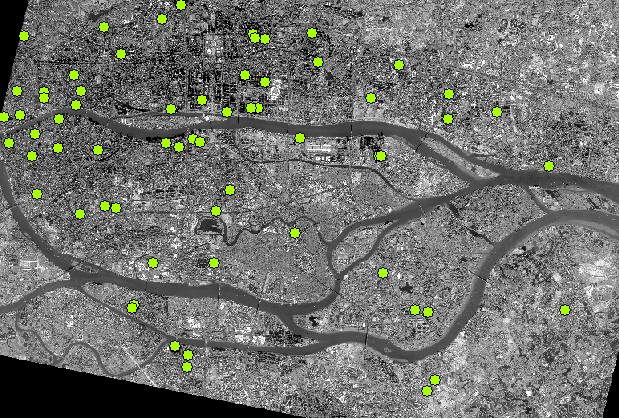
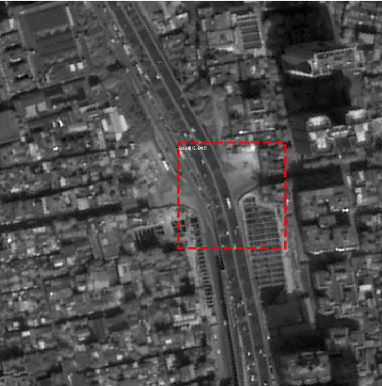
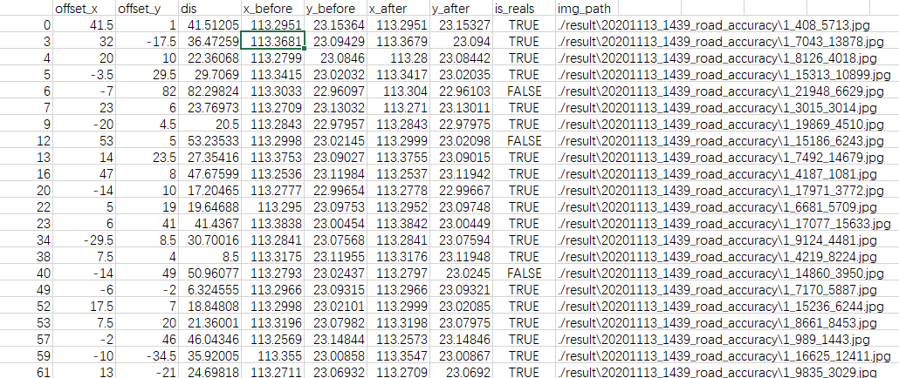
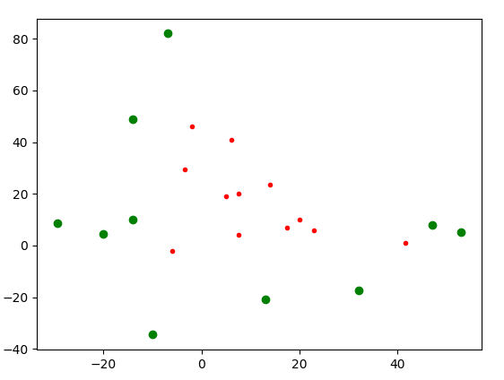

# road_segment
项目中利用mask rcnn实现矢量数据几何精度和数据质量的提升

### 环境配置
```bash
conda install --yes --file requirements.txt
```

### 主要功能介绍
sample_create_main.py 利用shp和tif数据自动化裁剪数据，制作训练样本集
road_train 利用样本集进行训练
raod_veriy 对训练结果进行验证
road_accuracy 利用训练模型，对shp和tif数据进行同名点结果验证

#### road_accuracy（同名点结果验证）
**原始数据**：遥感影像数据+矢量道路点数据


**提取影像中道路交叉口**：以矢量数据道路道路交叉点为中心，设置截取窗口裁剪影像，输入到训练好的神经网络中进行处理的得到，道路交叉口检测结果


**将像素坐标转成地理坐标**： 将提取道路交叉口的像素坐标转成地理坐标。


**数据筛选**： 利用DBSCAN聚类进行数据筛选


**同名点-可视化展示**：对同名特征点可视化进行可视化展示
